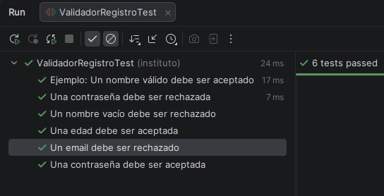

# 🧪 PruebasUnitarias1


Proyecto dedicado a la implementación y gestión de **Pruebas Unitarias** en entornos Java. Este repositorio sirve como base para el aprendizaje de testing automatizado, asegurando la calidad del código mediante validaciones exhaustivas.

---

## 🚀 Características

* **Testing Automatizado:** Implementación de casos de prueba con JUnit 5.
* **Gestión de Dependencias:** Configuración robusta mediante Apache Maven.
* **Estructura Profesional:** Organización de código siguiendo los estándares de la industria (`src/main` y `src/test`).
* **Historial de Versiones:** Registro detallado de cambios y resolución de conflictos en el archivo `GIT_LOG.md`.

---

## 🛠️ Tecnologías Utilizadas

* **Lenguaje:** Java 100%.
* **Framework de Testing:** JUnit 5 (Jupyter).
* **Gestor de Construcción:** Maven.
* **IDE Recomendado:** IntelliJ IDEA o VS Code.

---

## 📋 Requisitos Previos

Para ejecutar este proyecto, asegúrate de tener instalado:
* [JDK 11+](https://www.oracle.com/java/technologies/downloads/)
* [Maven 3.6+](https://maven.apache.org/download.cgi)

---

## 🔧 Instalación y Uso

1. **Clonar el repositorio:**
   ```bash
   git clone [https://github.com/daa0010/PruebasUnitarias1.git](https://github.com/daa0010/PruebasUnitarias1.git)

## Estructura del Proyecto

```text
PruebasUnitarias1/
├── src/
│   ├── main/java/      # Código fuente de la aplicación
│   └── test/java/      # Casos de prueba unitaria
├── pom.xml             # Configuración de dependencias Maven
├── GIT_LOG.md          # Registro de tareas y conflictos Git
└── README.md           # Documentación del proyecto
```

## Imagen de Demostración de Validación Correcta

